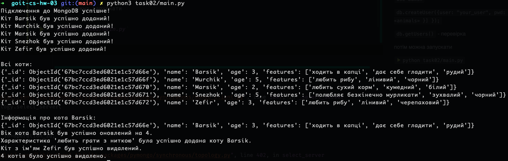

## Task01 ##
запуск бази данних:

`docker compose up -d --build`

створення таблиць:

`python task01/create_tables.py`

наповнення таблиць даними:

`python task01/seed.py`

виконання запитів:

`python task01/main.py`

## Task02 ##

`docker compose up -d`

щоб додати користувача, потрібно зробити наступне:

`docker exec -it mongo_db mongosh -u <myuser> -p <mypassword> --authenticationDatabase admin`

`use admin`

`db.createUser({user: "your_user", pwd: "your_password", roles: [{ role: «readWrite», db: «animals» }]
});`

`db.getUsers()` - перевірка

потім можна запускати

`python task02/main.py`

